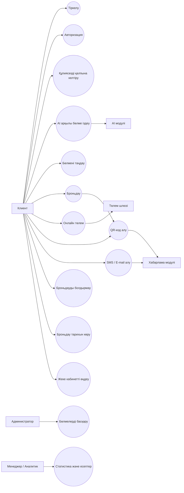

# Use Case Diagram

```mermaid
flowchart LR

    Client[Клиент]
    Admin[Администратор]
    Manager[Менеджер / Аналитик]
    AI[AI модулі]
    Payment[Төлем шлюзі]
    Notify[Хабарлама модулі]

    UC1((Тіркелу))
    UC2((Авторизация))
    UC3((Құпиясөзді қалпына келтіру))
    UC4((AI арқылы бөлме іздеу))
    UC5((Бөлмені таңдау))
    UC6((Броньдау))
    UC7((Онлайн төлем))
    UC8((QR-код алу))
    UC9((SMS / E-mail алу))
    UC10((Броньдауды болдырмау))
    UC11((Броньдау тарихын көру))
    UC12((Жеке кабинетті өңдеу))
    UC13((Бөлмелерді басқару))
    UC14((Статистика және есептер))

    Client --> UC1
    Client --> UC2
    Client --> UC3
    Client --> UC4
    Client --> UC5
    Client --> UC6
    Client --> UC7
    Client --> UC8
    Client --> UC9
    Client --> UC10
    Client --> UC11
    Client --> UC12

    Admin --> UC13
    Manager --> UC14

    UC4 --> AI
    UC7 --> Payment
    UC8 --> Notify
    UC9 --> Notify
    UC6 --> UC8
```
